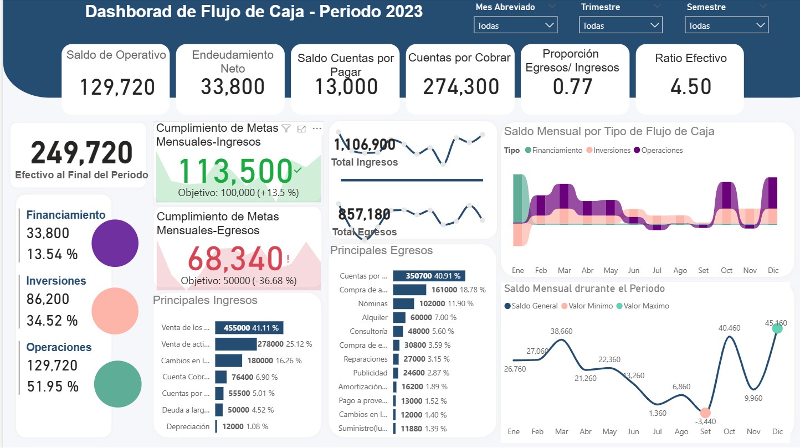
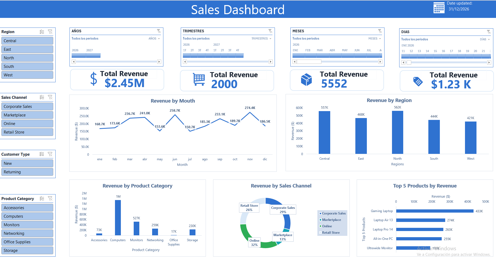
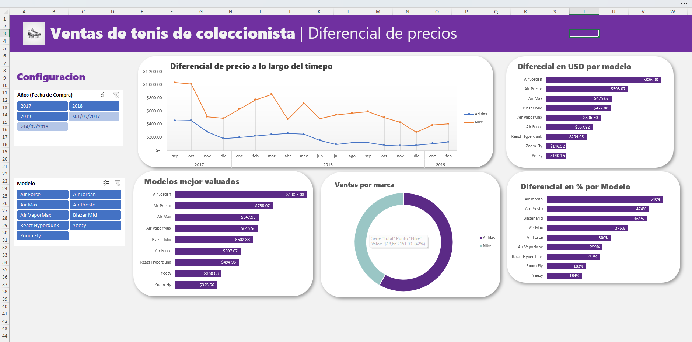
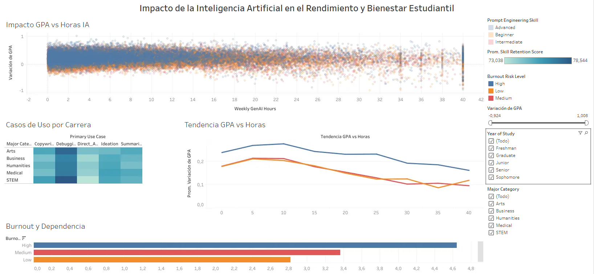

📊 Portafolio de Dashboards de Análisis de Datos
Colección de dashboards interactivos desarrollados para visualizar, analizar y comunicar insights de negocio a partir de datos financieros, comerciales y de comportamiento. Cada proyecto incluye filtros dinámicos, KPIs clave y visualizaciones diseñadas para facilitar la toma de decisiones.
---
🧭 Índice
Dashboard de Flujo de Caja 2023
Sales Dashboard
Ventas de Tenis de Coleccionista – Diferencial de Precios
Impacto de la IA en el Rendimiento y Bienestar Estudiantil
Tecnologías utilizadas
Contacto
---
💰 Dashboard de Flujo de Caja 2023 | POWER BI

Dashboard financiero interactivo que monitorea el flujo de caja mensual, distinguiendo entre actividades de financiamiento, inversión y operación. Incluye KPIs clave (saldo operativo, endeudamiento neto, ratio efectivo), cumplimiento de metas de ingresos/egresos y desglose de las principales fuentes de ingreso y gasto.
Highlights:
Filtros por mes, trimestre y semestre
Seguimiento de metas mensuales de ingresos y egresos
Visualización de saldo mensual por tipo de flujo de caja
---
📈 Sales Dashboard | EXCEL

Dashboard de ventas con filtros dinámicos por región, canal de venta, tipo de cliente y categoría de producto. Visualiza el revenue total, su evolución mensual, la distribución por región/canal y el top 5 de productos más vendidos, permitiendo un análisis comercial completo y segmentado.
Highlights:
KPIs de revenue total por año, trimestre, mes y día
Análisis de ingresos por categoría de producto y canal de venta
Ranking de productos top por ingresos generados
Dashboard interactivo en OneDrive: https://1drv.ms/f/c/b276070a1286865a/IgB38DgTFn6nRITLjwfovF13AfPg2i-NKLu50WNHv4jbSt8?e=MWnPkP
---
👟 Ventas de Tenis de Coleccionista – Diferencial de Precios | EXCEL

Análisis comparativo de precios de reventa entre marcas (Nike vs Adidas) para tenis de colección, con filtros por año y modelo. Muestra la evolución del diferencial de precio en el tiempo, un ranking de modelos mejor valuados y el diferencial porcentual por modelo.
Highlights:
Comparativa histórica de precios por marca
Ranking de modelos con mayor valorización
Diferencial de precio en USD y en porcentaje por modelo
Dashboard interactivo en OneDrive: https://1drv.ms/f/c/b276070a1286865a/IgB38DgTFn6nRITLjwfovF13AfPg2i-NKLu50WNHv4jbSt8?e=MWnPkP
---
🤖 Impacto de la IA en el Rendimiento y Bienestar Estudiantil | TABLEAU

Dashboard analítico que explora la relación entre el uso de IA generativa (horas semanales) y el desempeño académico (GPA) de estudiantes, segmentado por carrera, nivel de habilidad en prompt engineering y riesgo de burnout. Incluye correlaciones, tendencias y niveles de dependencia percibida.
Highlights:
Dispersión de variación de GPA vs. horas de uso de IA
Segmentación por carrera, año académico y nivel de habilidad
Análisis de riesgo de burnout y dependencia percibida
Dashboard Interactivo en Tableau Public: https://public.tableau.com/views/ImpactodelaInteligenciaArtificialenelRendimientoyBienestarEstudiantil/ImpactodelaInteligenciaArtificialenelRendimientoyBienestarEstudiantil?:language=es-ES&:sid=&:redirect=auth&:display_count=n&:origin=viz_share_link
---
🛠 Tecnologías utilizadas
Tableau / Power BI / Excel (Tablas dinámicas y modelado de datos)
DAX / Fórmulas avanzadas / Power Query / SQL
Diseño de KPIs e interactividad con slicers/filtros
Análisis exploratorio de datos (EDA) / ETL
---
📬 Contacto
¿Interesado en colaborar o conocer más sobre estos proyectos? ¡Contáctame!
💼 LinkedIn: ramses-hernandezg
📧 Email: ramsesgh65@gmail.com
